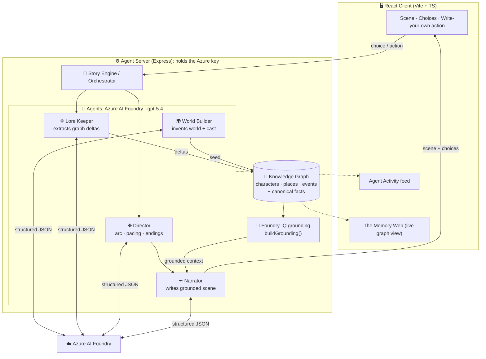
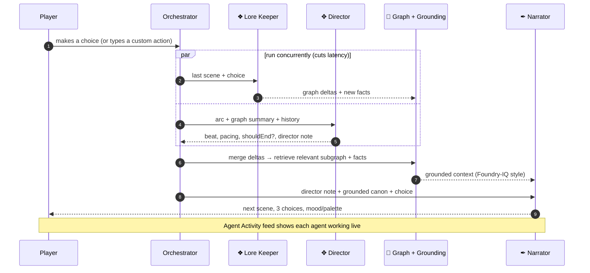
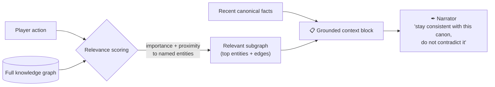
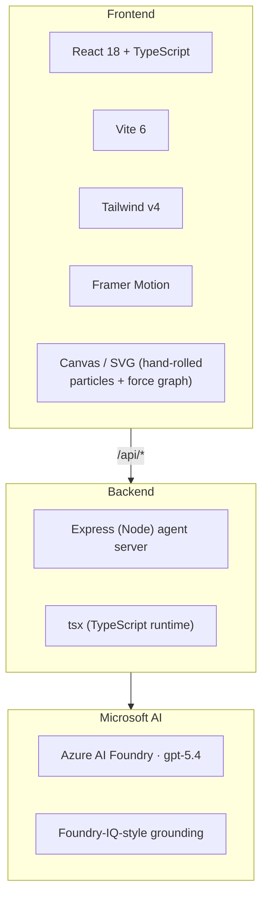

<div align="center">


# ∞ Infinitale

### An AI-powered visual novel with no script.

A team of autonomous agents on **Microsoft Azure AI Foundry** dreams a world into
being, remembers everything you do in a living knowledge graph, and bends the
story around your every choice: toward one of infinite endings.

<br/>


**[🚀 Quick start](#-quick-start) · [🎬 Demo & judging guide](DEMO.md) · [🏗️ Architecture](#%EF%B8%8F-agentic-architecture--schematic)**

</div>

---

## 🎯 The idea in one line

> Interactive fiction is normally a fixed tree of pre-written branches. **Infinitale
> has zero authored content**: every world, character, scene, choice, and ending is
> generated live by cooperating LLM agents that share a persistent, graph-structured
> memory. No two playthroughs are alike, and you can always *write your own action*,
> so the branching is genuinely open.

---

## 🧩 Microsoft AI technologies

Infinitale is built end-to-end on the Microsoft AI stack.

| Layer | Microsoft technology | How Infinitale uses it |
|---|---|---|
| **Reasoning / generation** | **Azure AI Foundry**: `gpt-5.4` deployment (chat completions, JSON mode) | The brain of all four agents. Every agent call is a structured-output request to the Foundry deployment. |
| **Grounded knowledge (Microsoft IQ)** | **Foundry IQ–style grounded retrieval** | A live **knowledge graph** is the canonical memory. Before each generation, a relevant subgraph + canonical facts are retrieved and injected as grounded context: *cited, grounded answers that reduce hallucination*, the core Foundry IQ value proposition. |
| **Content safety** | Azure AI Foundry content filters | Returned with every completion; safe-by-default generation for an open-ended story engine. |
| **AI-assisted development** | **GitHub Copilot** in VS Code | The agent prompts, grounding layer, and procedural UI were co-developed with Copilot (see [§ GitHub Copilot](#-github-copilot-in-the-build)). |

> **Why this satisfies the Microsoft IQ requirement:** the hardest problem in a
> fully-generated story is *coherence over time*. Infinitale solves it with a
> Foundry-IQ-style grounding seam (`server/graph.ts → buildGrounding()`) that turns
> the story's own memory into retrieved, grounded context the Narrator is contractually
> bound to. It is the exact pattern you would use to ground a Foundry agent on an
> enterprise corpus: here the "corpus" is the story's evolving canon.

---

## 🏗️ Agentic architecture: schematic

Four specialized agents, each with one sharp responsibility and a strict JSON
contract, orchestrated over a shared graph memory.



| Agent | Responsibility | Output contract |
|---|---|---|
| 🌍 **World Builder** | Turns a seed (random or 5-question quiz) into a world bible + the initial graph. | `worldBible` + `graph{nodes,edges}` |
| ❖ **Lore Keeper** | After every choice, extracts what changed: new entities, relationships, status updates, canonical facts. *This is the memory.* | `graph deltas` + `newFacts` |
| ✥ **Director** | Owns dramatic pacing. Tracks the arc (0–100) and decides the next beat (rising / twist / climax / **ending**). | `beat`, `arcDelta`, `shouldEnd`, `directorNote` |
| ✒ **Narrator** | Writes the next playable scene: prose, dialogue, mood, palette, 3 branching choices: **grounded** on the retrieved subgraph, under strict clarity rules. | `Scene{script, choices, palette, …}` |

---

## 🔄 What happens on every turn: schematic



The **Lore Keeper** and **Director** run **in parallel** (the Director reasons over
the *prior* graph summary, so it doesn't block on the merge), keeping turns
responsive. The multi-agent wait is surfaced as a feature: a live **Agent Activity**
indicator names each agent as it works.

---

## 🧠 Grounded retrieval: how hallucination is controlled



Plus a hard **clarity contract** on the Narrator: concrete literal prose, one
metaphor per scene max, every pronoun resolvable, every character introduced by
name *and* relationship, and **no references to anything not in canon or explained
on the spot.** Result: a fully-generated story that stays coherent: and *readable*:
across dozens of turns.

---

## ✨ Advantages

| | |
|---|---|
| ♾️ **Truly infinite** | No branch tree. 3 generated choices **+** open free-text actions **+** arc-driven alternative endings. |
| 🧠 **Persistent memory** | The knowledge graph remembers people, places, and consequences: and you can *see* it as **The Memory Web**. |
| 🚫 **Grounded, not hallucinated** | Foundry-IQ-style retrieval + a clarity contract keep stories consistent and easy to follow. |
| 🎬 **Cinematic, zero stock art** | Mood-driven **procedural** backgrounds (aurora gradients + ambient particle fields) generated per scene. |
| 🔍 **Transparent agents** | A live Agent Activity feed shows exactly what each agent did: the orchestration is the experience. |
| 🔐 **Secure by design** | The Azure key stays server-side; the browser only ever talks to `/api/*`. |
| 🧩 **Enterprise-ready seam** | The grounding layer is where you'd plug Azure AI Search / Foundry IQ to ground stories in any external corpus. |

---

## 🛠️ Technology stack



No heavy game or graph libraries: the force-directed Memory Web and the generative
backgrounds are written from scratch for performance and control.

---

## 🚀 Quick start

**Prerequisites:** Node.js 18+ and an Azure AI Foundry (Azure OpenAI) deployment.

```bash
# 1. Install
npm install

# 2. Configure credentials (server-side only: never shipped to the browser)
cp .env.example .env
#    fill in AZURE_OPENAI_ENDPOINT, AZURE_OPENAI_KEY, AZURE_OPENAI_DEPLOYMENT

# 3. Run the web client + agent server together
npm run dev
```

Open **http://localhost:5173**.

| Script | What it does |
|---|---|
| `npm run dev` | Vite dev server + agent API server (hot-reload) together. |
| `npm run server` | Just the agent/API server (`tsx watch`). |
| `npm run build` | Production build of the web client. |

**API**

| Endpoint | Body | Returns |
|---|---|---|
| `POST /api/start` | `{ mode: "random" \| "quiz", answers? }` | `worldBible`, opening `scene`, `graph`, `arc`, agent `trace` |
| `POST /api/turn` | `{ sessionId, choice }` | next `scene`, updated `graph`, `arc`, agent `trace` |

---

## 📁 Project structure

```
server/                 Node + Express agent server (holds the Azure key)
  azure.ts              Azure AI Foundry client (JSON mode + repair retry)
  agents.ts             World Builder · Lore Keeper · Director · Narrator
  graph.ts              Knowledge-graph memory + Foundry-IQ grounded retrieval
  orchestrator.ts       Story Engine: wires the agents over a session
  index.ts              HTTP API:  POST /api/start · POST /api/turn

src/                    Vite + React + TypeScript client
  App.tsx               Phase/state machine + live palette theming
  components/
    GenerativeBackground.tsx   Procedural canvas: gradient + particles
    SceneView.tsx              Typewriter VN playback
    ChoiceList.tsx             3 choices + write-your-own action
    MemoryGraph.tsx            Hand-rolled force-directed graph view
    AgentActivity.tsx          Live "the agents are working" pipeline
    TopBar.tsx                 Arc meter + agent activity feed
    StartScreen / Questionnaire / EndingScreen
```

---

## 🤖 GitHub Copilot in the build

Infinitale was developed with **GitHub Copilot** in VS Code as an AI pair programmer:

- **Agent prompt engineering**: iterating the four agents' system prompts and strict
  JSON contracts conversationally, including the clarity/anti-hallucination rules.
- **The grounding layer**: drafting `buildGrounding()`'s relevance scoring (importance
  + graph proximity) with Copilot Chat.
- **Procedural visuals**: the canvas particle systems and the hand-rolled
  force-directed graph physics were scaffolded with Copilot inline suggestions.
- **Scaffolding → core → polish**: Copilot accelerated the boilerplate (Express
  routes, React state machine, types) so effort went into the agentic design.

> *Tip for reviewers:* the commit history and inline comments reflect the
> foundation → core engine → polish iteration loop encouraged by the starter kit.

---

## 🔐 Security

The Azure subscription key lives **only** in `server/.env` (git-ignored) and is used
exclusively server-side. The browser talks to `/api/*`; the key is never bundled into
client code. **Rotate the key in the Azure portal before publishing this repo**, and
keep `.env` out of version control (`.gitignore` already excludes it).

---

## 🌱 Where it goes next

- **Real Foundry IQ / Azure AI Search** at the grounding seam: ground stories in an
  external lore wiki, a franchise bible, or a textbook.
- **Azure image deployment** for generated character portraits and scene art.
- **Branch from any past moment**: time-travel through the knowledge graph to fork
  the story from an earlier state.
- **Persistent saves** of worlds and graphs.

---

## 📄 License

Released under the [MIT License](LICENSE). See also the **[Demo & judging guide](DEMO.md)**.

<div align="center">

*Built for the Microsoft Agents League · Creative Apps track.*

</div>
